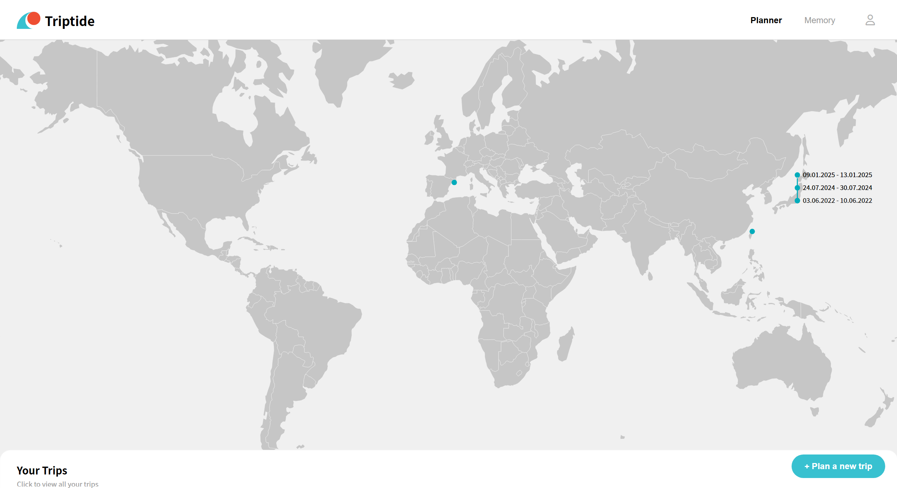

# Triptide

## Student Information

Name: Adelia Putri  
Student ID: 20210782  
Email: adelia@kaist.ac.kr  

Name: Chaebean Yang
Student ID: 20230412
Email: kazed0102@kaist.ac.kr

Git Repository: [Triptide](http://git.prototyping.id/20210782/travel-app)

Demo Video:

## Table of Contents
- [Triptide](#triptide)
  - [Student Information](#student-information)
  - [Table of Contents](#table-of-contents)
  - [App Description](#app-description)
  - [How to Start](#how-to-start)
  - [App Feature](#app-feature)
    - [Planner](#planner)
      - [Home Page](#home-page)
      - [Itinerary Page](#itinerary-page)
      - [My Trips Page](#my-trips-page)
    - [Memory](#memory)
      - [Home](#home)
      - [View photos by location Page](#view-photos-by-location-page)
      - [My Memories Page](#my-memories-page)
  - [App Features](#app-features)
  - [Code Organization](#code-organization)
    - [Tech Stack](#tech-stack)
    - [Component \& File Structure](#component--file-structure)
  - [Design Patterns](#design-patterns)
    - [MVC (Model-View-Controller)](#mvc-model-view-controller)
    - [Observer Pattern](#observer-pattern)
    - [Singleton Pattern](#singleton-pattern)
    - [Service Pattern](#service-pattern)
  - [Limitations](#limitations)
  - [Acknowledgement](#acknowledgement)

## App Description

**Triptide** is an intelligent travel planner that helps users create personalized itineraries by learning from their past trips. The app connects memories with future plans, allowing users to revisit previous journeys through photos and color mood boards, while planning new adventures based on those experiences. TravelApp leverages AI-powered recommendations, interactive maps, and seamless photo management to make travel planning both enjoyable and meaningful.

## How to Start

1. **Clone the repository:**
   ```bash
   git clone http://git.prototyping.id/20210782/travel-app
   cd travel-app
   ```
2. **Install dependencies:**
   ```bash
   npm install
   ```
3. **Set up environment variables:**
   - Fill in the required API keys (Firebase, Google, Unsplash, Uploadcare) in .env file
4. **Run the development server:**
   ```bash
   npm run dev
   ```
5. **Open the app:**
   - Visit [http://localhost:5173](http://localhost:5173) in your browser.

## App Feature

### Planner

#### Home Page
On the home page, users can view a summary of their past trips. Locations visited are marked on a world map. Clicking a marker reveals a list of trips to that location; clicking a trip label navigates directly to the detailed itinerary page for that trip.

<p align="center">
    
</p>

Users can add a new trip by clicking the `Plan a new trip` button at the bottom right and filling out the trip creation form.

#### Itinerary Page
Plan your trip by requesting AI-generated recommendations for places to visit. If you have previously visited the destination, the system will ask for your preference regarding the type of recommendations (new, old, or mixed).

<p align="center">
    
</p>

After receiving recommendations, **TravelApp** helps you organize them by dividing the places into your trip days, optimizing for travel time and location using OpenAI's itinerary division.

#### My Trips Page
View all your ongoing and past trips in one place.

<p align="center">
    
</p>

### Memory

#### Home
On the map, you can see all the locations where you've added photos. Additionally, if there are trips planned through the Triptide Planner that haven’t had any photos added yet, they will appear as markers. This visual connection between the planner and memory sections helps transform your travel plans into lasting memories.

<p align="center">
    
</p>

#### View photos by location Page
You can collect and revisit your travel photos all in one place. By uploading your images, you can visualize the mood of your journey through colors. When you’ve visited the same place more than once, you can compare each set of photos side by side, exploring visual similarities through shared color tones. This page offers a new, engaging way to reflect on your travels—through a uniquely visual and interactive experience.

<p align="center">
    
</p>

#### My Memories Page
Here, you can browse through the photo decks of all your trips.

<p align="center">
    
</p>

## App Features

- Smart suggestions for places to visit based on your travel history
- AI-powered itinerary generation, dividing recommended places into daily plans
- Add and manage memories for each trip, including photo uploads and color mood boards
- Visualize your travel history on an interactive world map, with clickable markers and trip summaries
- Seamless integration of past experiences into future travel planning

## Code Organization

### Tech Stack
- **Frontend:** SvelteKit
- **Database:** Firebase Realtime Database
- **Hosting:** Vercel
- **Libraries:**
  - D3.js for the map in `WorldMap.svelte`
- **APIs Used:**
  - Google Places API for autocomplete
  - Google Maps API for map visualizations
  - [OpenAI API](https://openai.com/index/openai-api/) (GPT-4.1 mini) for place recommendations and itinerary division
  - [Uploadcare](https://uploadcare.com) for uploading and converting photos to URLs
  - [Unsplash API](https://unsplash.com/developers) for fetching location-based photos

### Component & File Structure
```
.
├── README.md                  # Project documentation
├── package.json               # Project dependencies and scripts
├── src
│   ├── app.css                # Global styles
│   ├── firebase.js            # Firebase configuration
│   ├── lib
│   │   ├── components         # Svelte UI components
│   │   │   ├── AddPlaces.svelte      # Place autocomplete and selection
│   │   │   ├── Button.svelte         # Reusable button component
│   │   │   ├── MemoryPopup.svelte    # Popup for adding/viewing memories
│   │   │   ├── WorldMap.svelte       # Interactive world map visualization
│   │   │   └── ...                   # Other UI components
│   │   └── constants
│   │       ├── Colors.ts             # Color palette and theme
│   │       ├── CountryMappings.ts    # Country code mappings
│   │       └── Interfaces.ts         # Shared TypeScript interfaces
│   ├── routes
│   │   ├── itinerary/[tid]           # Itinerary page for a specific trip
│   │   ├── memories                  # Memory-related pages
│   │   ├── mymemory                  # User's personal memory pages
│   │   ├── trips                     # List and management of trips
│   │   ├── viewimage/[tripId]/[memoryId] # View a specific memory image
│   │   └── +page.svelte              # Home page route
│   └── services
│       ├── openai.ts                 # OpenAI API integration and prompts
│       └── unsplash.ts               # Unsplash API integration
├── static                            # Photos used in the project
├── svelte.config.js
├── tsconfig.json
└── vite.config.ts
```

## Design Patterns

### MVC (Model-View-Controller)
The app loosely follows the MVC pattern:
- **Model:** Data is managed in Firebase and accessed via service modules.
- **View:** Svelte components render the UI and respond to user interaction.
- **Controller:** Logic in Svelte scripts and service files acts as the controller, handling user actions and data flow.

### Observer Pattern
The observer pattern is used for real-time data updates:
- **Subject:** Firebase Realtime Database nodes (e.g., trips, memories)
- **Observer:** Svelte components subscribe to changes using Firebase's `onValue` method, automatically updating the UI when data changes.

### Singleton Pattern
- The Firebase app instance is implemented as a singleton in `firebase.js`, ensuring only one instance is used throughout the app.

### Service Pattern
- API integrations (OpenAI, Unsplash, Uploadcare) are abstracted into service modules, promoting code reuse and separation of concerns.

## Limitations

- **Image API Limitation:** Unsplash's free API restricts requests to 50 images per hour, which may affect the user experience when generating mood boards or searching for location-based images. Due to limitations of the free version of Uploadcare, EXIF metadata (such as timestamp and location) is stripped during image upload. As a result, we were unable to provide contextual information extracted from images.
- **Map Interactions:** Currently, markers on the map in the itinerary page are not clickable or interactive, limiting direct navigation from the map to trip details.
- **Memory Photo Limit:** Adding a large number of photos to a trip can result in slow page rendering and decreased performance.

## Acknowledgement
