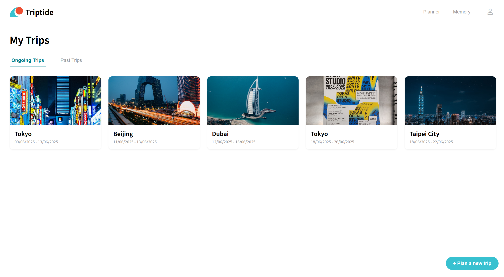

<p align="center">
    <a href="https://triptide.netlify.app">
      
    </a>
</p>
<p align="center">
    
    &nbsp;&nbsp;
    
    &nbsp;&nbsp;
    
    &nbsp;&nbsp;
    
</p>

# Student Information

Name: Adelia Putri  
Student ID: 20210782  
Email: adelia@kaist.ac.kr  

Name: Chaebean Yang  
Student ID: 20230412  
Email: kazed0102@kaist.ac.kr

Git Repository: [Triptide Repository](http://git.prototyping.id/20210782/travel-app)  
Live Demo: [Triptide](https://triptide.netlify.app)  
Demo Video: [Triptide Demo Video](https://youtu.be/l9IxPiXSwII)

# Table of Contents
- [Student Information](#student-information)
- [Table of Contents](#table-of-contents)
- [App Description](#app-description)
- [How to Run Locally](#how-to-run-locally)
- [Core Features](#core-features)
  - [Planner: Plan Your Next Adventure](#planner-plan-your-next-adventure)
    - [Home Page](#home-page)
    - [Itinerary Page](#itinerary-page)
    - [My Trips Page](#my-trips-page)
  - [Memory: Relive Your Journeys](#memory-relive-your-journeys)
    - [Home Page](#home-page-1)
    - [View Photos by Location Page](#view-photos-by-location-page)
    - [My Memories Page](#my-memories-page)
- [Code Organization](#code-organization)
  - [Tech Stack](#tech-stack)
  - [Component \& File Structure](#component--file-structure)
  - [Database Structure](#database-structure)
  - [Design Patterns](#design-patterns)
    - [MVC (Model-View-Controller)](#mvc-model-view-controller)
    - [Observer Pattern](#observer-pattern)
    - [Singleton Pattern](#singleton-pattern)
    - [Service Pattern](#service-pattern)
  - [Limitations](#limitations)
  - [Acknowledgement](#acknowledgement)

# App Description

**Triptide** isn't just a planner, it's your personal travel story. It weaves together the memories of where you've been with the excitement of where you'll go next. Relive your journeys through vibrant photo galleries and color mood boards, then let those experiences inspire your next adventure through AI-powered recommendations.

# How to Run Locally

1. **Prerequisites**
   - Node.js (v18 or later)
2. **Clone the repository**
   ```bash
   git clone http://git.prototyping.id/20210782/travel-app
   cd travel-app
   ```
3. **Install dependencies**
   ```bash
   npm install
   ```
4. **Set up environment variables**  
   Create a `.env` file in the project root and add the following API keys.
   ```bash
    # Firebase Configuration
    VITE_FIREBASE_API_KEY="your_firebase_api_key"
    VITE_FIREBASE_AUTH_DOMAIN="your_firebase_auth_domain"
    VITE_FIREBASE_DATABASE_URL="your_firebase_database_url"
    VITE_FIREBASE_PROJECT_ID="your_firebase_project_id"
    VITE_FIREBASE_STORAGE_BUCKET="your_firebase_storage_bucket"
    VITE_FIREBASE_MESSAGING_SENDER_ID="your_firebase_messaging_sender_id"
    VITE_FIREBASE_APP_ID="your_firebase_app_id"

    # Google Maps API
    VITE_GOOGLE_MAPS_API_KEY="your_google_maps_api_key"

    # OpenAI API
    VITE_OPENAI_API_KEY="your_openai_api_key"

    # Unsplash API
    VITE_UNSPLASH_API_KEY="your_unsplash_api_key"

    # Uploadcare API
    VITE_UPLOADCARE_PUBLIC_KEY="your_uploadcare_public_key"
    ```
5. **Run the development server**
   ```bash
   npm run dev
   ```
6. **Open the app**
   - Visit [http://localhost:5173](http://localhost:5173) in your browser.

# Core Features

## Planner: Plan Your Next Adventure

### Home Page
Visualize your global travel history on an interactive world map. Markers indicate every location you've visited. Clicking a marker reveals a list of trips to that location and clicking a trip label navigates directly to the detailed [itinerary page](#itinerary-page) for that trip.

<p align="center">
    
</p>

Users can add a new trip by clicking the `Plan a new trip` button at the bottom right and filling out the trip creation form.

### Itinerary Page
Plan your trip by requesting AI-generated recommendations for places to visit. If you have previously visited the destination, **Triptide** will ask for your preference regarding the type of recommendations (new, old, or mixed).

<p align="center">
    
</p>

After receiving recommendations, **Triptide** helps you organize them by dividing the places into your trip days, optimizing for travel time and location with a help from LLM.

### My Trips Page
View all your upcoming and past trips in one place.

<p align="center">
    
</p>

## Memory: Relive Your Journeys

### Home Page
On the map, you can see all the locations where you've added photos. Additionally, if there are trips planned through the Triptide Planner that haven’t had any photos added yet, they will appear as markers. This visual connection between the planner and memory sections helps transform your travel plans into lasting memories.

<p align="center">
    
</p>

### View Photos by Location Page
You can collect and revisit your travel photos all in one place. By uploading your images, you can visualize the mood of your journey through colors. When you’ve visited the same place more than once, you can compare each set of photos side by side, exploring visual similarities through shared color tones. This page offers a new, engaging way to reflect on your travels—through a uniquely visual and interactive experience.

<p align="center">
    
</p>

### My Memories Page
Browse a gallery of all your past trips, each represented by a photo deck.

<p align="center">
    
</p>

# Code Organization

## Tech Stack
- **Frontend:** SvelteKit
- **Database:** Firebase Realtime Database
- **Hosting:** Netlify
- **Libraries:**
  - D3.js to render the interactive `WorldMap.svelte`
- **APIs Used:**
  - [Google Places API](https://developers.google.com/maps/documentation/places/web-service/overview) for Place Autocomplete widget
  - [Google Maps Javascript API](https://developers.google.com/maps/documentation/javascript/overview) for map visualizations
  - [OpenAI API](https://openai.com/index/openai-api/) (GPT-4.1 mini) for place recommendations and itinerary division
  - [Uploadcare](https://uploadcare.com) for uploading and converting photos to URLs
  - [Unsplash API](https://unsplash.com/developers) for fetching location-based photos

## Component & File Structure
```
.
├── README.md                  # Project documentation
├── package.json               # Project dependencies and scripts
├── src
│   ├── app.css                # Global styles
│   ├── firebase.js            # Firebase configuration
│   ├── lib
│   │   ├── components         # Svelte UI components
│   │   │   ├── AddPlaces.svelte      # Place autocomplete and selection
│   │   │   ├── Button.svelte         # Reusable button component
│   │   │   ├── MemoryPopup.svelte    # Popup for adding/viewing memories
│   │   │   ├── WorldMap.svelte       # Interactive world map visualization
│   │   │   └── ...                   # Other UI components
│   │   └── constants
│   │       ├── Colors.ts             # Color palette and theme
│   │       ├── CountryMappings.ts    # Country code mappings
│   │       └── Interfaces.ts         # Shared TypeScript interfaces
│   ├── routes
│   │   ├── itinerary/[tid]           # Itinerary page for a specific trip
│   │   ├── memories                  # Memory-related pages
│   │   ├── mymemory                  # User's personal memory pages
│   │   ├── trips                     # List and management of trips
│   │   ├── viewimage/[tripId]/[memoryId] # View a specific memory image
│   │   └── +page.svelte              # Home page route
│   └── services
│       ├── openai.ts                 # OpenAI API integration and prompts
│       └── unsplash.ts               # Unsplash API integration
├── static                            # Photos used in the project
├── svelte.config.js
├── tsconfig.json
└── vite.config.ts
```

## Database Structure
<p align="center">
    
</p>


## Design Patterns

### MVC (Model-View-Controller)
- **Model:** Data is managed in Firebase and accessed via service modules.
- **View:** Svelte components render the UI and respond to user interaction.
- **Controller:** Logic in Svelte scripts and service files acts as the controller, handling user actions and data flow.

### Observer Pattern
The observer pattern is used for real-time data updates
- **Subject:** Firebase Realtime Database nodes (e.g., trips, memories)
- **Observer:** Svelte components subscribe to changes using Firebase's `onValue` method, automatically updating the UI when data changes.

### Singleton Pattern
- The Firebase app instance is implemented as a singleton in `firebase.js`, ensuring only one instance is used throughout the app.

### Service Pattern
- API integrations (OpenAI, Unsplash) are abstracted into service modules in `src/services`, promoting code reuse and separation of concerns.

## Limitations

- **API Rate Limiting:** The Unsplash free tier limits API calls to 50 requests/hour, which can temporarily disrupt the image-fetching feature during heavy use.
- **UAPI Rate Limiting:** Due to limitations of the free version of Uploadcare, EXIF metadata (such as timestamp and location) is stripped during image upload. As a result, we were unable to provide contextual information extracted from images.
- **Map Interactions:** Markers on the itinerary page map are currently for display only and are not clickable.
- **Memory Photo Limit:** Adding a large number of photos to a trip can result in slow page rendering and decreased performance.

## Acknowledgement
- Logo icons were obtained from [Font Awesome](https://fontawesome.com)
- The world map GeoJSON data was retrieved from [GeoJSON Maps](https://geojson-maps.kyd.au)
- The implementation of the Place Autocomplete widget was guided by the official [Google Maps Platform documentation](https://developers.google.com/maps/documentation/javascript/place-autocomplete-new?_gl=1*bm2lge*_up*MQ..*_ga*MTIzMjUwMzgwNS4xNzQ4Njk3OTgw*_ga_NRWSTWS78N*czE3NDg3NTIwMTkkbzMkZzAkdDE3NDg3NTIwMTkkajYwJGwwJGgwv)
- Cursor was used for initial page scaffolding from Figma designs and for generating code comments to improve readability.
- The official [SvelteKit Docs](https://svelte.dev/docs/kit/introduction) were an essential resource for resolving deprecation problems